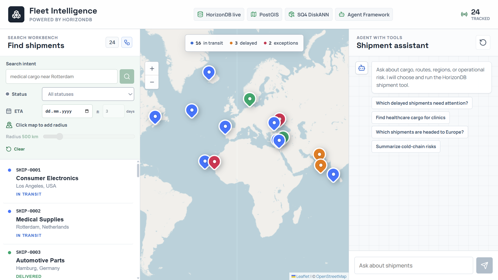
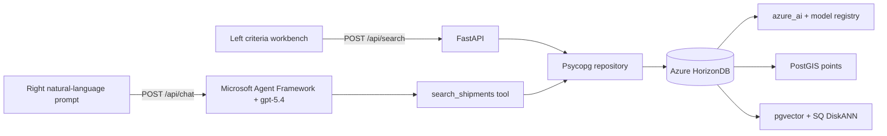

# HorizonDB Fleet Intelligence

HorizonDB Fleet Intelligence is a customer-ready spatial and semantic operations
sample built with FastAPI, Psycopg 3, React, and Vite. Two intentionally separate
workflows demonstrate:

- PostGIS stores origin, destination, and current shipment positions as SRID
  4326 points and serves them to a Leaflet world map.
- HorizonDB's built-in `default-embedding` model creates 1,536-dimensional
  vectors through the `azure_ai` model registry.
- PostGIS `ST_DWithin` constrains retrieval to a map-selected search radius.
- pgvector cosine distance (`<=>`) and spatial distance produce a hybrid rank.
- DiskANN accelerates cosine search with 4-bit spherical quantization and
  advanced filtered-search settings.
- Microsoft Agent Framework runs a `gpt-5.4` shipment assistant. Its one typed
  tool invokes the same Psycopg-backed semantic search used by the criteria API.
- HorizonDB's `default-chat` alias resolves to `gpt-5.4`; the Agent Framework
  adapter plans tool calls and writes grounded answers through `azure_ai.generate`.

The repository includes 24 realistic global shipments. Only a HorizonDB
connection is required because semantic search and assistant answers both use
models managed by the database service.

## User Interface

The left workbench sends a prompt plus explicit status, ETA, and map-radius
criteria to `/api/search`. It is a deterministic search form, not a chat. The
right panel sends only a natural-language prompt to `/api/chat`; Agent Framework
chooses the tool arguments. Both paths project their exact result rows onto the
shared list and Leaflet map, with scores and execution plans available as evidence.



## Technical Demo

The [customer demo package](demo/README.md) contains the final narrated video,
the [PowerPoint recording deck](demo/fleet-intelligence-demo.pptx) with presenter
notes and embedded live-demo clips, the
[16-slide HTML presentation](demo/fleet-intelligence-slides.html), and the live
application and plan captures. Internal production automation remains excluded
from Git.

## Architecture



The criteria path applies operator-selected status, ETA, center, and radius values.
The prompt-only agent path has no UI criteria. Agent Framework must call
`search_shipments` exactly once; the tool embeds its query in HorizonDB and
retrieves rows through the same repository method. When a radius is present on
the criteria path, the final rank is 72% semantic and 28% spatial. Only tool rows
are passed to `gpt-5.4` as grounding context, so the answer and visible cards use
the same evidence.

## Repository Layout

| Path | Purpose |
| --- | --- |
| `backend/app/main.py` | FastAPI application and REST routes |
| `backend/app/agent.py` | Agent Framework definition and typed `search_shipments` tool |
| `backend/app/horizon_agent_client.py` | HorizonDB-backed Agent Framework chat client and tool loop |
| `backend/app/repository.py` | Async Psycopg, PostGIS projection, and vector search |
| `backend/app/setup_database.py` | Idempotent schema, seed, model verification, embedding, and index setup |
| `database/schema.sql` | HorizonDB extensions and relational/vector schema |
| `frontend/src` | React operations console, Leaflet map, and agent chat |
| `azure.yaml` and `infra` | Azure Developer CLI, native HorizonDB Bicep, and Container Apps deployment |

## Deploy to Azure

The repository includes an `azd` deployment for a native
`Microsoft.HorizonDb/clusters@2026-01-20-preview` cluster, Azure Container
Registry, a Container Apps environment, and separate backend and frontend
Container Apps.

### Prerequisites

- Azure Developer CLI 1.15 or newer and Azure CLI.
- A subscription enabled for the HorizonDB preview.
- The `Microsoft.OrionDB` provider registered in that subscription. The provider
  namespace remains `Microsoft.OrionDB` while the Bicep resource type is
  `Microsoft.HorizonDb`.
- Contributor and User Access Administrator, or equivalent permissions to create
  managed identities and role assignments.
- One of the currently supported preview regions: `australiaeast`, `centralus`,
  `uaenorth`, `uksouth`, or `westus3`.
- HorizonDB access to the built-in `default-chat` (`gpt-5.4`) and
  `default-embedding` (`text-embedding-3-small`) aliases.

Register the preview provider once if necessary:

```powershell
az provider register --namespace Microsoft.OrionDB
```

Deploy the complete sample from the repository root:

```powershell
az login
azd auth login
azd up
```

The preprovision hook validates the provider and region and adds the deployer's
public IPv4 address to the HorizonDB firewall. Bicep pre-approves `azure_ai`,
`vector`, `pg_diskann`, and `postgis`, creates the database, and verifies both
built-in model aliases. The backend container then runs the idempotent schema,
seed, embedding, and SQ4 DiskANN setup before starting FastAPI. The frontend
serves the Vite build through Nginx and proxies same-origin `/api` requests to the
backend Container App.

The postdeploy hook fails unless live health reports Agent Framework with
`gpt-5.4` and spherical-quantized DiskANN with 4-bit codes and 25,000 training
samples. Remove all deployed resources with:

```powershell
azd down --purge
```

HorizonDB is a preview service. Region and subscription availability can change;
the hooks fail with a direct prerequisite message rather than substituting a
non-HorizonDB database.

## Run Locally

The sample has a Python backend and a React frontend. You will run both from
source in two terminals. No prebuilt application is required.

### 1. Install Python and Node.js

#### Windows

1. Download and install [Python for Windows](https://www.python.org/downloads/windows/).
  Choose Python 3.11 or newer and enable **Add Python to PATH** in the
  installer.
2. Download and install the LTS version of
  [Node.js](https://nodejs.org/en/download). Node.js also installs the `npm`
  command used by the frontend.
3. Close and reopen VS Code after both installations finish.

Open **Terminal > New Terminal** in VS Code. The terminal should say
PowerShell. Run these commands one line at a time:

```powershell
py --version
node --version
npm --version
```

#### macOS

1. Download and install [Python for macOS](https://www.python.org/downloads/macos/).
  Choose Python 3.11 or newer and run the downloaded installer package.
2. Download and install the LTS version of
  [Node.js](https://nodejs.org/en/download). Choose the macOS installer.
  Node.js also installs `npm`.
3. Close and reopen VS Code after both installations finish.

Open **Terminal > New Terminal** in VS Code. Run these commands one line at a
time:

```bash
python3 --version
node --version
npm --version
```

For either operating system, Python must be 3.11 or newer and Node.js must be
20.19 or newer. If a command is not found, restart VS Code. If it is still
unavailable, reinstall that tool and make sure its PATH option is enabled.

### 2. Gather the Azure settings

The application requires live Azure services. Have these values ready before
continuing:

- An Azure HorizonDB host, database name, user, and password.
- Access to the built-in `default-chat` and `default-embedding` HorizonDB model
  aliases.

Ask your Azure administrator for any values you do not have. Do not put keys
or passwords in files that will be committed to source control.

### 3. Open the project folder

Download or clone this repository. In VS Code, select **File > Open Folder**
and choose the `horizondb-fleet-intelligence` folder. Then select **Terminal > New Terminal**.
The terminal prompt should end with `horizondb-fleet-intelligence`; the commands below assume
you are in that folder.

### 4. Set up the Python backend

Run the block for your operating system. These commands create a private
Python environment in `backend/.venv`, install the backend packages, and copy
the settings template. You only need to do this once.

#### Windows PowerShell

```powershell
Set-Location backend
py -m venv .venv
.\.venv\Scripts\python -m pip install -e ".[dev]"
Copy-Item .env.example .env
```

#### macOS Terminal

```bash
cd backend
python3 -m venv .venv
./.venv/bin/python -m pip install -e ".[dev]"
cp .env.example .env
```

You do not need to activate the virtual environment. The remaining commands
call the project's private Python installation directly.

### 5. Add the Azure settings

In the VS Code Explorer, open `backend/.env`. Replace the placeholder text on
the right side of each `=` with your Azure values:

```dotenv
AZURE_PG_HOST=your-horizondb-host
AZURE_PG_NAME=your-database-name
AZURE_PG_USER=your-database-user
AZURE_PG_PASSWORD=your-database-password
AZURE_PG_PORT=5432
AZURE_PG_SSLMODE=require

EMBEDDING_MODEL_ALIAS=default-embedding
CHAT_MODEL_ALIAS=default-chat
```

Keep the connection-pool values already in the file. The `backend/.env` file
is ignored by Git. As an alternative to the individual `AZURE_PG_*` values,
advanced users can set `DATABASE_URL` to a complete PostgreSQL connection
string.

### 6. Prepare the database

Stay in the `backend` folder and run the command for your operating system.

#### Windows PowerShell

```powershell
.\.venv\Scripts\python -m app.setup_database
```

#### macOS Terminal

```bash
./.venv/bin/python -m app.setup_database
```

The first run can take a few minutes. It enables the database extensions,
creates the schema, loads 24 sample shipments, generates embeddings, and
builds the DiskANN index. Wait for this confirmation:

```text
Fleet Intelligence ready: 24 shipments, 24 HorizonDB model embeddings, primary DiskANN index: ready
```

You can run the setup command again safely. It updates the database without
duplicating the sample shipments.

### 7. Start the backend

In the same terminal, run the command for your operating system.

#### Windows PowerShell

```powershell
.\.venv\Scripts\python -m app.server
```

#### macOS Terminal

```bash
./.venv/bin/python -m app.server
```

Wait until the terminal says Uvicorn is running on
`http://127.0.0.1:8000`. Leave this terminal open. You can verify the backend
by opening `http://127.0.0.1:8000/docs` in a browser.

### 8. Start the frontend

In VS Code, select **Terminal > New Terminal** to open a second terminal. It
should start in the `horizon-ship` folder. Run the block for your operating
system.

#### Windows PowerShell

```powershell
Set-Location frontend
npm install
npm run dev
```

#### macOS Terminal

```bash
cd frontend
npm install
npm run dev
```

The `npm install` command downloads the frontend packages. You only need to
run it the first time, or after the packages in `package.json` change. Leave
this second terminal open.

### 9. Open and stop the application

Open `http://127.0.0.1:5173` in a browser. Vite sends `/api` requests to the
backend on port 8000, so both terminals must remain running while you use the
application. Set `VITE_API_URL` only when the API runs at a different address.

To stop the application, click inside each terminal and press **Ctrl+C**. On
Windows, type `Y` and press **Enter** if PowerShell asks you to confirm.

### 10. Run the application again later

You do not need to recreate the Python environment, reinstall packages, or
prepare the database each time. Open two terminals in the `horizon-ship`
folder and run the commands for your operating system.

#### Windows PowerShell

Terminal 1:

```powershell
Set-Location backend
.\.venv\Scripts\python -m app.server
```

Terminal 2:

```powershell
Set-Location frontend
npm run dev
```

#### macOS Terminal

Terminal 1:

```bash
cd backend
./.venv/bin/python -m app.server
```

Terminal 2:

```bash
cd frontend
npm run dev
```

### Common first-run fixes

- If the frontend cannot connect, make sure the backend terminal is still
  running and `http://127.0.0.1:8000/docs` opens successfully.
- If the backend reports missing configuration or authentication failures,
  check the values in `backend/.env` and rerun the database setup command.
- If PowerShell says scripts are disabled when you run `npm`, use `npm.cmd`
  in place of `npm`, such as `npm.cmd run dev`.
- If port 8000 or 5173 is already in use, stop the older backend or frontend
  process with **Ctrl+C**, then run the command again.

## Runtime Requirements

The application has one runtime connection. HorizonDB provides PostGIS, SQ
DiskANN search over built-in embeddings, and `gpt-5.4` inference through the
registered `default-chat` alias. FastAPI fails at startup when the connection is
missing, either model alias is unavailable, any shipment lacks an embedding, or
the primary index is missing any required spherical-quantization option.

## Spatial-Semantic Search

The shared repository creates the query vector inside HorizonDB. Criteria search
can apply status, ETA, and PostGIS radius filters; the agent tool supplies only
natural-language intent and an optional status inferred from that prompt. Both
keep vector distance in the candidate `ORDER BY ... LIMIT` so DiskANN serves
candidate retrieval:

```sql
WITH query_vector AS (
    SELECT azure_openai.create_embeddings(
        'default-embedding',
        'delayed electronics from Asia'
    )::pg_catalog.vector(1536) AS embedding
)
SELECT
    shipment.shipment_number,
    shipment.title,
  ST_Distance(shipment.current_position::geography, :center) / 1000 AS distance_km,
  1 - (shipment.embedding <=> query_vector.embedding) AS cosine_similarity
FROM horizon_ship.shipments AS shipment
CROSS JOIN query_vector
WHERE ST_DWithin(shipment.current_position::geography, :center, :radius_meters)
ORDER BY shipment.embedding <=> query_vector.embedding
LIMIT 100;
```

The primary index uses HorizonDB's spherical quantization preview:

```sql
CREATE INDEX shipments_embedding_diskann_idx
    ON horizon_ship.shipments
    USING diskann (embedding vector_cosine_ops)
    WITH (
        spherical_quantized = true,
        sq_bits = 4,
        sq_training_samples = 25000
    );
```

Filtered requests enable DiskANN strict iterative search and the filter hook in
a transaction-local scope before executing the query.

## Agent Framework

`/api/chat` accepts only `query` and `limit`; extra criteria fields are rejected.
The first `gpt-5.4` turn returns JSON arguments for the decorated
`search_shipments` tool. Agent Framework validates and invokes that tool. The
second turn receives only the serialized shipment rows and produces the grounded
answer. The chat response returns those same rows for the list and map.

## API

| Method | Route | Purpose |
| --- | --- | --- |
| `GET` | `/api/health` | Database, extension, embedding, and AI model readiness |
| `GET` | `/api/shipments` | List shipments with optional status/text filters |
| `GET` | `/api/shipments/stats` | Fleet counts by status |
| `GET` | `/api/shipments/{number}` | Shipment details and PostGIS coordinates |
| `GET` | `/api/explain/last` | Last literalized SQL statement and text execution plan |
| `POST` | `/api/search` | Prompt plus explicit status, ETA, location, and radius criteria |
| `POST` | `/api/chat` | Prompt-only Agent Framework answer plus its grounded rows |

## Execution Plans

Every runtime `SELECT` is preceded by:

```sql
EXPLAIN (ANALYZE, BUFFERS, WAL, FORMAT TEXT)
```

The backend separately retains the list-all plan and the spatial-semantic plan
that produced the current search results, together with SQL rendered using
PostgreSQL literals. The compact execution-plan icon beside the count is always
available and selects the plan matching the displayed rows. It is the only
list-side control that opens the plan window. Each Agent Framework response also
contains its own plan snapshot; the `Query + plan` button above that turn's cards
opens the exact SQL and plan even after a later criteria search runs.

The plan pane has Text and Graph tabs. The graph preserves parent-child plan
structure so bitmap combinations, index scans, and their conditions can be read
as one flow. It also exposes HorizonDB `DiskANNFilteredScan`, strategy, and
collected TID diagnostics. Criteria controls use the same status colors as the
shipment markers. The query and plan panes can be resized with the divider or
its arrow-key controls.

Result badges show cosine similarity as `cos 0.63`, not as a percentage or
probability. Shipment embeddings are generated from title, description, origin,
destination, current location, status, and metadata. The ETA calendar applies a
center date plus or minus the selected number of days using the
`shipments_eta_idx` B-tree index when selected by the planner, and can be cleared
independently. In the SQL pane, prompt, status, ETA, point coordinates, and
radius literals use distinct highlights so user inputs can be followed through
the query.

Reading `/api/explain/last` does not run a database query and therefore does not
replace the captured plan.

`EXPLAIN ANALYZE` executes its statement. The application then executes the
same statement to obtain rows, so this demonstration mode intentionally runs
each `SELECT` twice, including model-backed statements.

## Optional Validation

To run the automated checks, first open a terminal in the `backend` folder.

Windows PowerShell:

```powershell
.\.venv\Scripts\python -m pytest -q
.\.venv\Scripts\python -m ruff check app tests
```

macOS Terminal:

```bash
./.venv/bin/python -m pytest -q
./.venv/bin/python -m ruff check app tests
```

Then open a terminal in the `frontend` folder. These commands are the same on
Windows and macOS:

```bash
npm run build
npm run lint
```

The application does not require a frontend environment file for the default
local development ports.