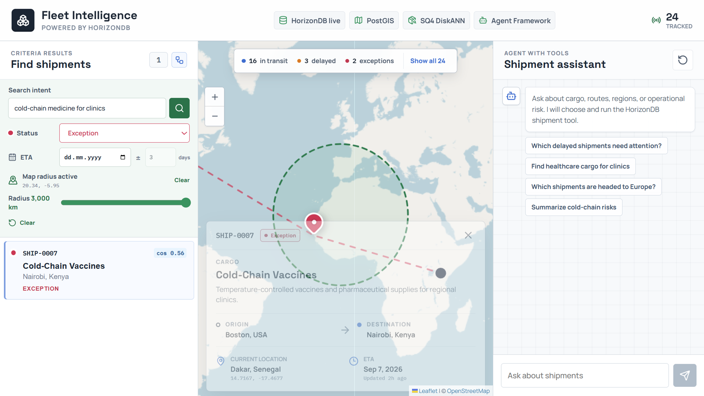
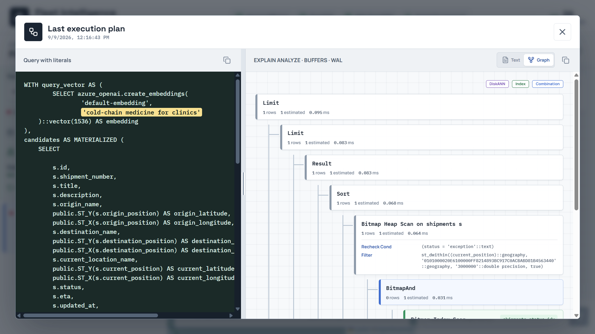
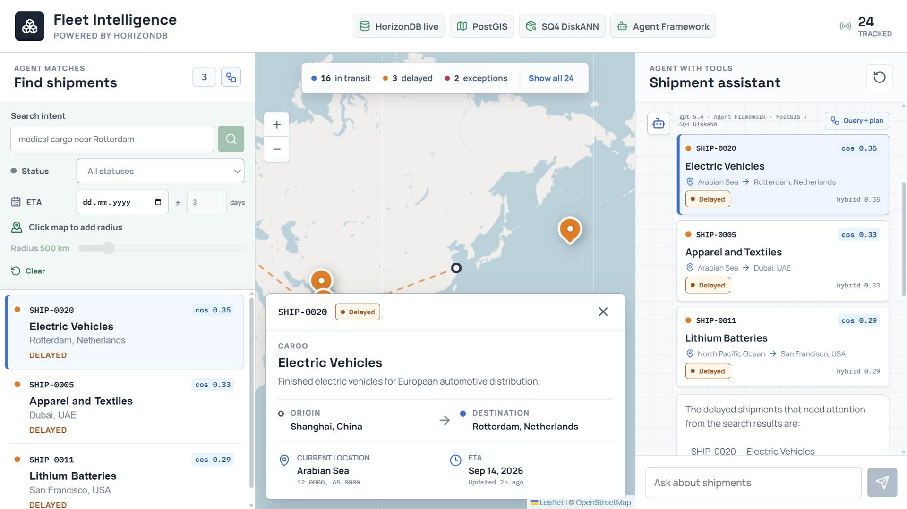
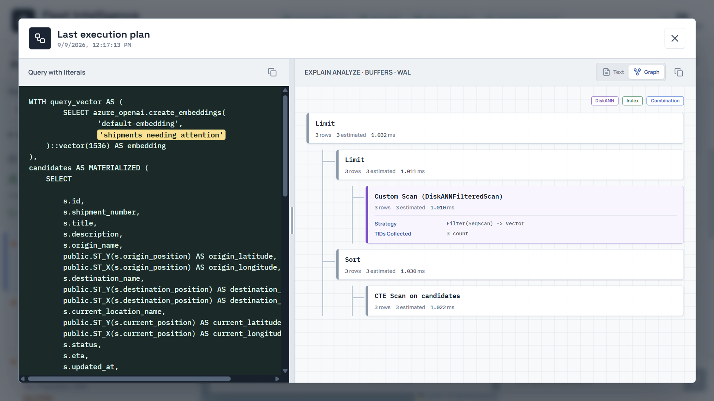

# Two Ways to Ask One Database: PostGIS and AI Retrieval in Azure HorizonDB


Fleet operators rarely search with a single kind of question. Sometimes they know exactly what they want: delayed shipments, within a certain radius of a location, arriving in a given window. Other times they only have intent, phrased in a sentence: "which delayed shipments need attention?" The first case is a deterministic filter. The second is a semantic search that a language model can shape into a query. Both need to run against the same operational data, return the same kind of exact rows, and stay inspectable enough that an operator can trust the result.

The usual answer is to split that data: keep the transactional and spatial rows in one system and copy embeddings into a separate vector store, with a search service in front. That works, but it duplicates the data, adds a synchronization problem, and hides the retrieval behind an API that no longer shows how a result was reached.

The goal here is to keep both kinds of question against one database. I built a small sample application, HorizonDB Fleet Intelligence, that tracks 24 global shipments and answers them two ways: a criteria search form on the left, and a prompt-only assistant on the right. Both call the same repository, both use PostGIS for location and pgvector for meaning, and both expose the exact SQL and execution plan that produced their rows. This post walks through the goal, the two paths, and the queries and execution plans behind each. The interesting part is not that PostgreSQL can call an AI model; it is that the whole retrieval workflow, spatial filtering, vector ranking, and model reasoning, stays next to the data and remains readable.


I ran this on Azure HorizonDB (preview), PostgreSQL 17.11, with `postgis` 3.6.1, `vector` 0.8.0, `pg_diskann` 0.7.3, and `azure_ai` 2.2.2 enabled, and both model aliases registered. HorizonDB is a preview service, so region and subscription availability can change, and the plans and numbers below reflect what I ran rather than a support statement.

## The data model

Each shipment is one row that carries relational fields, three PostGIS points, a JSON metadata blob, and a 1,536-dimensional embedding. The location columns are `geometry(Point, 4326)`, the standard WGS 84 longitude/latitude reference used by web maps.

```sql
CREATE TABLE IF NOT EXISTS horizon_ship.shipments (
    id uuid PRIMARY KEY DEFAULT pg_catalog.gen_random_uuid(),
    shipment_number text NOT NULL UNIQUE,
    title text NOT NULL,
    description text NOT NULL,
    origin_name text NOT NULL,
    origin_position public.geometry(Point, 4326) NOT NULL,
    destination_name text NOT NULL,
    destination_position public.geometry(Point, 4326) NOT NULL,
    current_location_name text NOT NULL,
    current_position public.geometry(Point, 4326) NOT NULL,
    status text NOT NULL CHECK (
        status IN ('in_transit', 'delivered', 'delayed', 'exception', 'unknown')
    ),
    eta date,
    updated_at timestamptz NOT NULL DEFAULT now(),
    embedding vector(1536),
    metadata jsonb NOT NULL DEFAULT '{}'::jsonb
);
```

The indexes give the planner several selective alternatives, which matters later because the two paths deliberately let the planner choose differently. There is a B-tree on `status`, a B-tree on `eta`, a GiST index on the geometry, and a second GiST index on the geography cast used by radius search:

```sql
CREATE INDEX shipments_current_position_gix
    ON horizon_ship.shipments USING gist (current_position);
CREATE INDEX shipments_current_position_geography_gix
    ON horizon_ship.shipments USING gist ((current_position::public.geography));
CREATE INDEX shipments_status_idx
    ON horizon_ship.shipments (status);
CREATE INDEX shipments_eta_idx
    ON horizon_ship.shipments (eta);
```

The vector index is DiskANN with HorizonDB's spherical quantization preview: four-bit codes trained on 25,000 samples, using cosine distance to match the embedding model.

```sql
CREATE INDEX shipments_embedding_diskann_idx
    ON horizon_ship.shipments
    USING diskann (embedding vector_cosine_ops)
    WITH (
        spherical_quantized = true,
        sq_bits = 4,
        sq_training_samples = 25000
    );
```

The embeddings themselves come from HorizonDB's model registry, so I do not deploy or register a model by hand. The `default-embedding` alias resolves to `text-embedding-3-small` (1,536 dimensions), and `default-chat` resolves to `gpt-5.4`. Setup generates each row's embedding inside the database from the shipment's business fields:

```sql
UPDATE horizon_ship.shipments AS shipment
SET embedding = azure_openai.create_embeddings(
    'default-embedding',
    concat_ws(
        ' ',
        shipment.title,
        shipment.description,
        shipment.origin_name,
        shipment.destination_name,
        shipment.current_location_name,
        shipment.status,
        shipment.metadata::text
    )
)::vector(1536)
WHERE ...;
```

No embeddings leave the database, and no separate vector store is involved.

## Two paths, one repository

The interface separates two kinds of work on purpose. On the left, a criteria workbench posts a prompt plus explicit status, ETA window, map center, and radius to `POST /api/search`. That is a deterministic form, not a chat. On the right, the operator sends only a natural-language question to `POST /api/chat`, and Microsoft Agent Framework lets `gpt-5.4` choose the arguments for one typed tool.

The important design decision is that both paths call the **same** repository method, `semantic_search`. The criteria path fills in the filters from the form; the agent path fills them in from what the model inferred. Nothing from the left form leaks into the agent request, and the agent request contract enforces that: the `/api/chat` model forbids extra fields, so posting status or radius to it returns HTTP 422 before Agent Framework even runs.

Here is the shared query, exactly as the repository builds it (the `%s` placeholders are bound with parameters; the criteria path supplies real values, the agent path passes `NULL` for the filters it did not infer):

```sql
-- 1. Embed the query text in the database, using the same model
--    (default-embedding) that produced the row embeddings.
WITH query_vector AS (
    SELECT azure_openai.create_embeddings(
        %s,           -- embedding model alias
        %s            -- query text
    )::vector(1536) AS embedding
),
-- 2. Retrieve candidates. MATERIALIZED forces this CTE to run once and
--    be reused, so the vector distance is computed a single time.
candidates AS MATERIALIZED (
    SELECT
        s.shipment_number,
        s.title,
        -- ... projected columns, PostGIS points unpacked with ST_X / ST_Y ...

        -- 2a. Cosine distance between the row and the query embedding.
        s.embedding <=> query_vector.embedding AS vector_distance,

        -- 2b. Great-circle distance in km to the map center, only when a
        --     center was supplied (otherwise NULL).
        CASE WHEN %s::double precision IS NULL THEN NULL ELSE
            public.ST_Distance(
                s.current_position::public.geography,
                public.ST_SetSRID(
                    public.ST_MakePoint(%s, %s), 4326
                )::public.geography
            ) / 1000.0
        END AS distance_km
    FROM horizon_ship.shipments AS s
    CROSS JOIN query_vector
    -- 2c. Optional filters. Each is "parameter IS NULL OR <condition>",
    --     so an unused filter drops out and the planner can ignore it.
    WHERE (%s::text IS NULL OR s.status = %s)          -- status
        AND (                                          -- ETA window
            %s::date IS NULL
            OR s.eta BETWEEN
                %s::date - (%s * INTERVAL '1 day')
                AND %s::date + (%s * INTERVAL '1 day')
        )
        AND (                                          -- PostGIS radius
            %s::double precision IS NULL
            OR public.ST_DWithin(
                s.current_position::public.geography,
                public.ST_SetSRID(
                    public.ST_MakePoint(%s, %s), 4326
                )::public.geography,
                %s * 1000.0
            )
        )
    -- 2d. Order by cosine distance and cap the list. This is the step
    --     DiskANN serves: nearest neighbors first, then LIMIT.
    ORDER BY s.embedding <=> query_vector.embedding
    LIMIT %s
)
-- 3. Score and rank. Pure cosine similarity when there is no radius,
--    otherwise a 72% semantic / 28% spatial blend.
SELECT
    candidates.*,
    1 - vector_distance AS similarity,
    CASE WHEN distance_km IS NULL THEN 1 - vector_distance ELSE
        0.72 * (1 - vector_distance)
        + 0.28 * GREATEST(0, 1 - distance_km / %s)
    END AS hybrid_score
FROM candidates
ORDER BY hybrid_score DESC
LIMIT %s;
```

A few things are worth pointing out. The query embedding is created inside HorizonDB with `azure_openai.create_embeddings`, so the same model that embedded the rows also embeds the query, on the same connection. Each optional predicate is written as `%s IS NULL OR <condition>`, so an unused filter disappears from the effective query and the planner is free to ignore it. The inner `ORDER BY ... <=> ... LIMIT` keeps cosine distance as the candidate-retrieval step, which is what lets DiskANN serve it. The outer query then produces a hybrid score: pure cosine similarity when there is no radius, and a 72% semantic / 28% spatial blend when a radius is present.

### Why 72% semantic and 28% spatial

The weighting is a deliberate product choice, not a mathematical constant. Both terms are first normalized to the same 0-to-1 scale so they can be added: cosine similarity is `1 - vector_distance`, and the spatial term is `GREATEST(0, 1 - distance_km / radius)`, which is 1 at the exact center and falls linearly to 0 at the edge of the requested radius (and is clamped at 0 beyond it). Without normalization, a distance measured in kilometers and a cosine value between 0 and 1 could not be combined meaningfully.

Meaning is weighted higher than proximity because the operator has already expressed proximity as a hard filter: the `ST_DWithin` predicate has removed everything outside the radius, so every surviving candidate is "close enough" by definition. Inside that set, what should break ties is how well the cargo matches the intent, not which shipment happens to sit a few kilometers nearer the center. The 28% spatial weight still rewards proximity, so a strong semantic match right next to the center outranks an equally strong match at the far edge, but it does not let raw distance override a clearly better cargo match. The exact split is easy to tune; the principle is that relevance leads and proximity refines. When there is no radius at all, as on the agent path, the spatial term is dropped entirely and the score is pure similarity.

Because the two paths share this query, the only thing that changes between them is which parameters are `NULL`. That is what makes the execution plans interesting: the same SQL shape produces two very different plans depending on how selective the filters are.

## Path one: criteria search

For the first search I ask for cold-chain medicine for clinics, select the `exception` status, center the map near Dakar in West Africa, and choose a 3,000-kilometer radius. This is a highly selective request. In the sample data it returns exactly one row: SHIP-0007, Cold-Chain Vaccines. The cosine similarity is 0.56 and the hybrid score is 0.69. No model reasoning is needed to interpret those explicit filters.



The application does not force an index. Every runtime `SELECT` is first run through `EXPLAIN (ANALYZE, BUFFERS, WAL, FORMAT TEXT)`, and the plan is retained alongside the literalized SQL. For this selective request, the planner does not touch the vector index at all. It combines the status B-tree and the PostGIS geography GiST index with a `BitmapAnd`, feeds one row into a Bitmap Heap Scan, and rechecks `ST_DWithin` there:

```text
->  Bitmap Heap Scan on shipments s (actual time=21.684..21.687 rows=1 loops=1)
      Recheck Cond: (status = 'exception'::text)
      Filter: st_dwithin((current_position)::geography, '...'::geography, '3000000'::double precision, true)
      Heap Blocks: exact=1
      ->  BitmapAnd (actual time=0.020..0.020 rows=0 loops=1)
            ->  Bitmap Index Scan on shipments_status_idx (actual time=0.007..0.007 rows=2 loops=1)
                  Index Cond: (status = 'exception'::text)
            ->  Bitmap Index Scan on shipments_current_position_geography_gix (actual time=0.012..0.012 rows=3 loops=1)
                  Index Cond: ((current_position)::geography && _st_expand('...'::geography, '3000000'::double precision))
```

This is the right call. The status B-tree returns two candidate rows, the geography GiST index returns three, and the `BitmapAnd` intersects them; the `ST_DWithin` recheck on the heap confirms the single match. Resolving that with relational and spatial selectivity is far cheaper than an approximate nearest-neighbor scan, and the whole query ran in about 22 ms. The vector distance is still computed in the outer query to produce the similarity and hybrid score, but it is not driving the access path. The SQL pane shows every literal, prompt, status, coordinates, and radius, so the operator can see exactly what was asked and how it was answered.

Note that the GiST index scan uses the `&&` bounding-box operator against `_st_expand(...)`, which is the index-friendly part of `ST_DWithin`. The exact distance test is then applied as the recheck, so the spatial predicate is both index-accelerated and exact.

The application shows the same thing as a graph, with the literal SQL beside it. The `BitmapAnd` and its two bitmap index scans are visible as one flow, and the SQL pane highlights each user-supplied literal:



## Path two: the prompt-only agent

For the second search I clear the left criteria and just ask the assistant: "Which delayed shipments need attention?" The request body contains only that question.



Behind that, Microsoft Agent Framework runs a bounded two-turn loop while model inference stays inside HorizonDB. On the first turn, `gpt-5.4` is asked, through `azure_ai.generate`, to return JSON arguments for a single registered tool, `search_shipments`. The model chooses `delayed` as the status and rewrites the intent to something like "shipments needing attention". Agent Framework validates those arguments and invokes the tool exactly once. That tool calls the same `semantic_search` method, with the model-chosen status and no spatial or ETA filter. On the second turn, the model receives only the serialized result rows and writes the grounded answer. The client caps the run at two model iterations and one function call, so the orchestration stays predictable.

The tool is a plain typed function; the framework reads its schema from the annotations:

```python
@tool(
    name="search_shipments",
    description=(
        "Search live shipments by meaning and optional status. HorizonDB retrieves "
        "candidates with spherical-quantized DiskANN and returns ranked evidence."
    ),
    max_invocations=1,
)
async def search_shipments(query_text: str, status_filter: StatusArgument = "all") -> str:
    ...
```

This time the filter is not selective enough to win as a bitmap, so the planner takes the vector path. Before running a filtered vector query, the repository enables DiskANN's strict iterative search and filter hook in a transaction-local scope:

```sql
SET LOCAL diskann.iterative_search TO 'strict_order';
SET LOCAL diskann.enable_filter_hook TO 'true';
SET LOCAL diskann.selectivity_min TO '0.0';
SET LOCAL diskann.selectivity_threshold TO '1.0';
SET LOCAL diskann.filtering_beta TO 0.85;
SET LOCAL diskann.l_value_is TO 300;
```

The plan is now a custom DiskANN scan. Strict iterative search applies the `delayed` filter and then vector ordering, collecting exactly the tuples that match:

```text
->  Custom Scan (DiskANNFilteredScan) (actual time=0.942..0.967 rows=3 loops=1)
      Strategy: Filter(SeqScan) -> Vector
      Rows Retrieved: 3 count
      TIDs Collected: 3 count
```

The strategy line reads `Filter(SeqScan) -> Vector`: the `delayed` filter is applied first, then the vector index orders the survivors. It collected three tuple identifiers and retrieved three rows, and the whole statement ran in about 1.2 ms. Those three rows, Electric Vehicles, Apparel and Textiles, and Lithium Batteries, are the same rows that appear as cards in the answer, in the left-hand list, and on the map. The query pane exposes the model-selected semantic phrase and the cosine operator, so the vector path is as inspectable as the relational one. Filtered vector search is exactly what a separate vector store tends to hide; here it stays in the plan.

The plan graph makes the strategy explicit. The `Query + plan` button on the agent turn opens the exact SQL the model produced, "shipments needing attention" highlighted, next to the `DiskANNFilteredScan` node with its strategy and TID count:



Both plans come from the identical query. The criteria request was selective, so the planner chose `BitmapAnd` over the status B-tree and geography GiST. The agent request was broad, so the planner chose `DiskANNFilteredScan` and let the vector index order the candidates. That is the payoff of keeping one query and one dataset: the planner adapts to the shape of each question instead of the application hard-coding an access path.

### The two plans do the same thing under the hood

These two access paths look different in the plan, but they are solving the same problem the same way: reduce the table to the set of rows that satisfy the predicates, expressed as tuple identifiers (TIDs), the physical `(block, offset)` addresses of rows.

In the criteria plan, each index produces a bitmap of TIDs. The status B-tree contributes the TIDs of `exception` rows, the geography GiST index contributes the TIDs whose bounding box intersects the radius, and `BitmapAnd` intersects the two bitmaps into the TIDs that satisfy both. The heap is then visited for exactly those TIDs and the exact `ST_DWithin` is rechecked. The predicates are resolved first; the rows come last.

The DiskANN filtered scan does the equivalent, but in the opposite order and against a graph. Rather than ordering by distance and hoping the top results happen to be `delayed`, strict iterative search evaluates the filter *during* graph navigation: as it walks the nearest-neighbor graph it keeps only the TIDs that pass the `delayed` predicate, and keeps walking until it has collected enough matches in nearest-first order. That is what `Filter(SeqScan) -> Vector` and `TIDs Collected: 3` describe, the filter builds the set of eligible TIDs, and the vector index visits them in similarity order.

So a bitmap index scan and a pre-filtered ANN search are two implementations of one idea: build the set of TIDs that match the predicates, then combine it, by bitmap intersection in one case, by filtering the candidates during navigation in the other. This is exactly the capability a separate vector store usually lacks. A pure HNSW index, for instance, orders by distance with no way to intersect a relational predicate into the walk, so it either over-fetches and filters afterward or misses matches. Keeping the vectors in the same table as the relational and spatial columns is what lets one predicate feed the other.

## A note on inspectability

Every runtime `SELECT` in this sample is executed twice on purpose. The backend first runs it under `EXPLAIN (ANALYZE, BUFFERS, WAL, FORMAT TEXT)` to capture the real plan with buffer and WAL statistics, then runs the same statement to fetch rows. That is a demonstration choice, not something you would do in production, but it means every result carries the literal SQL and the plan that produced it. Each agent answer keeps its own plan snapshot too, so the `Query + plan` control still shows that turn's SQL and plan even after a later criteria search runs. Because `EXPLAIN ANALYZE` runs the statement, the model-backed statements run twice as well.

## Takeaways

This started as a practical customer question: show PostGIS on HorizonDB, then combine location with AI in something that looks like a real development stack. The result is one operational database with two trustworthy ways to ask.

When the operator knows the criteria, the left workflow keeps status, time, and geography deterministic, and the planner resolves it with B-tree and GiST bitmaps. When the intent is conversational, `gpt-5.4` gets one controlled Agent Framework tool over the same repository, and the planner serves it from spherical-quantized DiskANN. In both cases the rows, scores, SQL literals, and planner decisions stay visible. Relational data, PostGIS geometry, pgvector embeddings, and AI model calls all live in the same HorizonDB instance, so there is no second store to synchronize and no retrieval hidden behind an opaque service.

The pattern starts with shipment tracking but transfers directly to fleet, taxi, bus, and security dispatch, anywhere service intent and proximity matter together. If you want to try HorizonDB capabilities like these, the PostgreSQL Hub has sample applications and learning paths, and the PostgreSQL Developer Forum is the best place to share feedback and ask questions.
```
